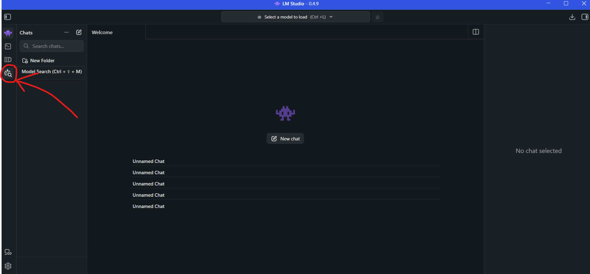
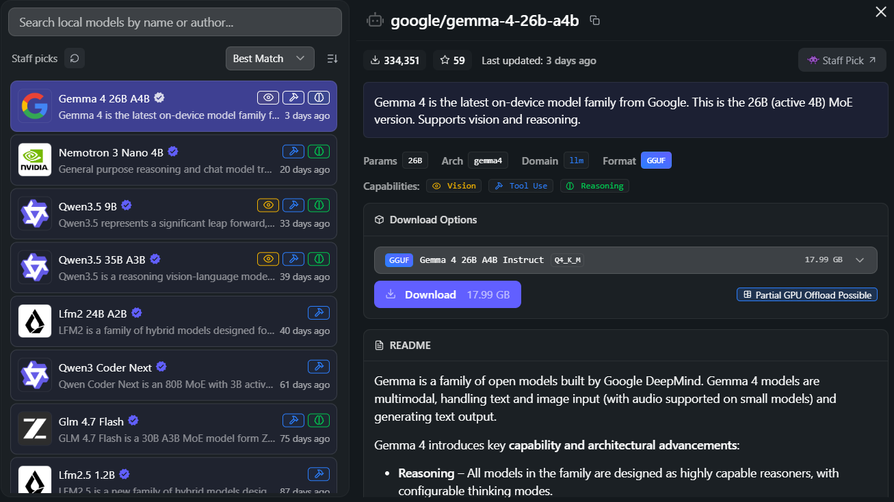
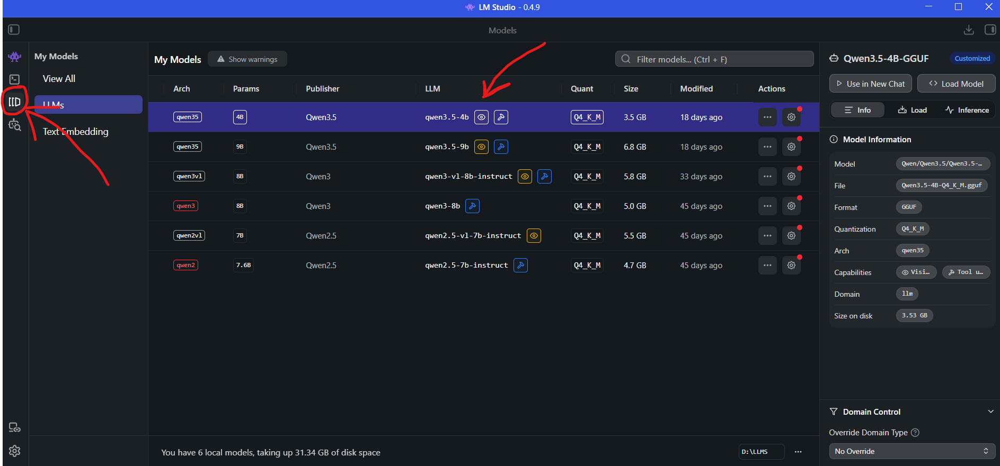
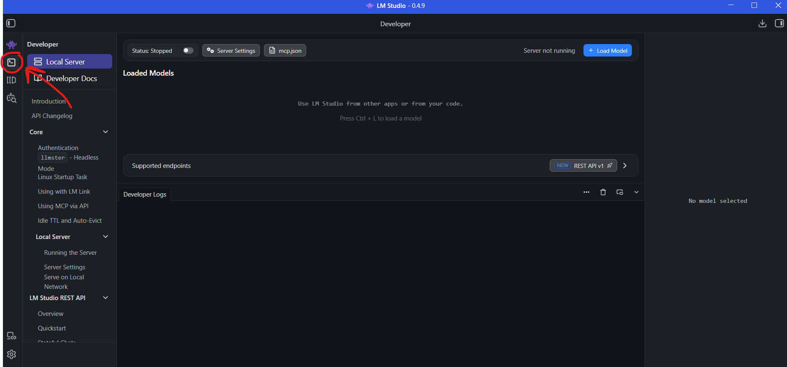
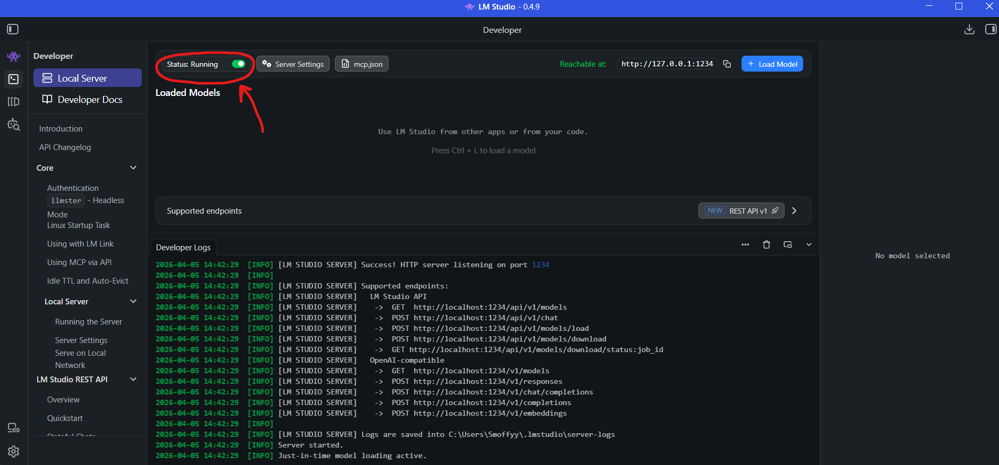
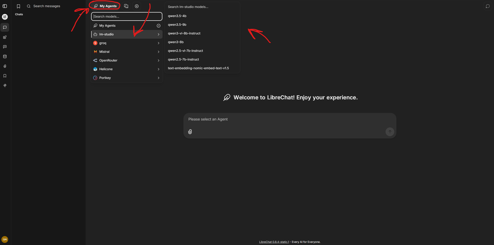
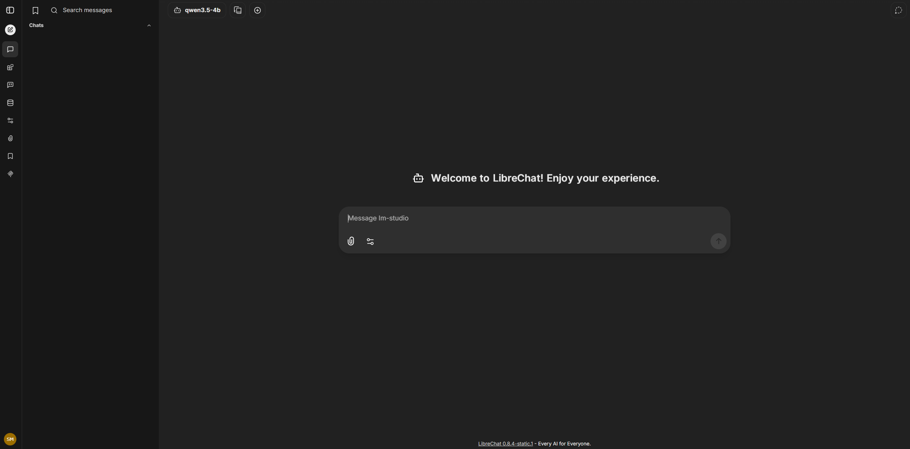
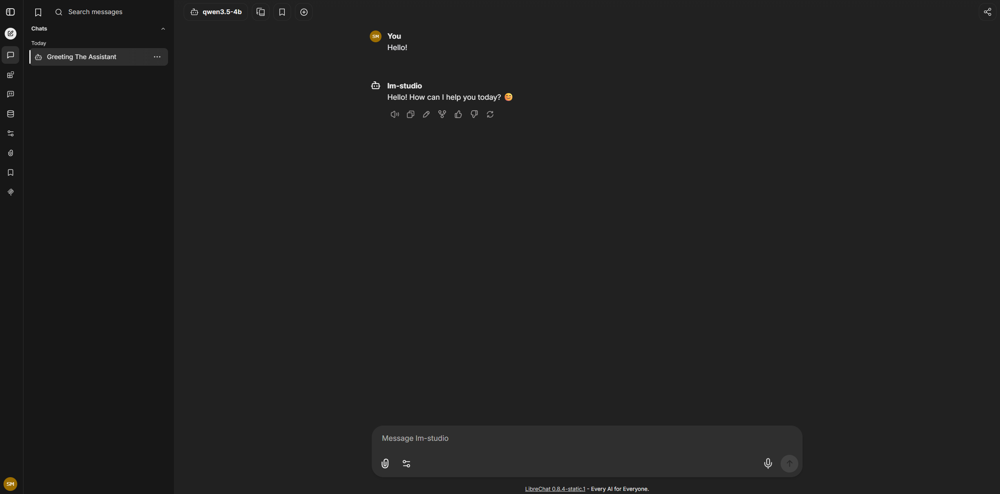

# Local Service Setup

Below is a tutorial on how to get LibreChat working with whatever services you're wanting to use locally, such as Ollama, LM-Studio, or anything using the OpenAI-API compatible API.

### LM-Studio Setup
LM-Studio is the easiest way to get your backend server running to be used in LibreChat.

### Getting Started

#### 1. Download LM-Studio
Download the appropriate [LM-Studio](https://lmstudio.ai/download) edition for your Operating System.

#### 2. Download Any Model
Once you've gone through the installation of [LM-Studio](https://lmstudio.ai/download), you should download a model you want to use. LM-Studio may prompt you to download a model already. **If not**, look for the sidebar on the left side of the app, and look for an Icon with a Robot head and Magnifying glass icon such as the one below in the screenshot.



---

After that, you should see a menu pop up like this:



After this menu pops up, **you may select any model you'd like** to use and download via the download button as shown, here is an example of downloading [Qwen 3.5 2B](https://lmstudio.ai/deeplink?owner=qwen&name=qwen3.5-2b), you can click on the model name here to automatically download it.

---

Once your model is downloaded, it should pop up in your `My Models` tab, the images below will show how to get to it.



The model you just downloaded should show up in the middle, mine is different as I've downloaded different models. This docs wont show how to configure the models, but will show you how to get a server instance running locally that you can chat directly with.

---

#### 3. Start your Server

Now that you've downloaded a model and verified its in your `My Models` tab, now it's time to start your LM-Studio server! This server is used to start an OpenAI-API Compatible server in which you can connect the front-end UI, LibreChat, to communicate to. This is all entirely running locally on your machine!

Head on over to the Server tab, the icon should be a Terminal Icon as shown below:



Now that you're on the server tab, we need to start our server. Click on the `Status: Stopped` switch and enable it as shown below:



You should see an output in the terminal at the bottom of the app. These are all the ports that LM-Studio uses to communicate. By default, LM-Studio uses the port `1234`, this tutorial uses the default port.

---

#### 3. Edit Librechat Files
Awesome, now you got your very own LM-Studio instance running! Now we need to make sure LibreChat recognizes that you're running a local OpenAI-API instance, and be able to communicate with it! Below I will be using the default .example files to showcase what it would be like to setup as a newcomer!

There is already an example of how to use LM-Studio, we need to edit our librechat.yaml.

First, copy the `librechat.example.yaml` and rename it to `librechat.yaml`, you can do this by using the command, or manually renaming it yourself:
```
copy librechat.example.yaml librechat.yaml
```

Now after we have our `librechat.yaml`, it's time we uncomment some lines and add some things!

Around line ~283, you'll see a word `custom:`, right below that is the LM-Studio example, you need to uncomment all of the example code for LM-Studio. For ease of use, you can just copy this directly and override everything until the `custom:`, this has the proper formatting so you can do it!
```
  custom:
    # LM-Studio Example
    - name: 'lm-studio'
      apiKey: 'none' # You can set an API key if you'd like.
      baseURL: 'http://host.docker.internal:1234/v1' # If you're using docker use this, if not, use the http://localhost:1234/v1
      models:
        default: # Update these with whatever model's you're going to be using, this is for hotswapping.
          - 'qwen3.5-9b'
          - 'qwen3.5-2b'
        fetch: true
      titleConvo: true
      titleModel: 'current_model' # use the current model for title also
      modelDisplayLabel: 'lm-studio'
```

Now, about the `baseURL`, this is what your LM-Studio server instance should be running on if you're compiling this with Docker. If you're not using docker, you do not use `host.docker.internal`, instead you'd use directly what your LM-Studio server is reachable at, e.g. `http://127.0.0.1:1234`

If all you're going to use is LM-Studio, you can delete everything below the `modelDisplayLabel: 'lm-studio'` line.

#### 4. Launch LibreChat

If you haven't already the following commands to build the images, please do so:
  ```
  docker compose build --no-cache
  docker compose up -d
  ```

If you already have, and want to restart the container whenever you make changes to the `librechat.yaml`, do so by the following command:
  ```
  docker compose restart
  ```

After that, you should go to `http://localhost:3080`, and open a chat. You must create an account and log into it, then you should see this:


When you're at this screen, at the top left you'll see the text `My Agents`, you need to click that as shown below:



The process goes, click `My Agents`, then `lm-studio`, then whatever model you're wanting to chat with, such as `qwen3.5-4b`. When you click a model it should update and say the model name at the top left:



Now you can message it!



There you go!, this is the most basic and efficient way to get ready and start messaging models. If you're wanting a more advanced guide to setting it up to look professional, please look at the AdvancedLMSTUDIOSetup.md please.