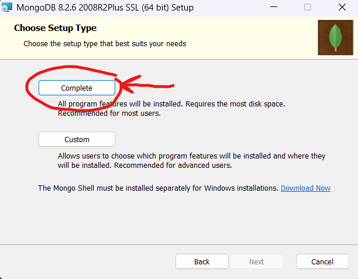

# NPM Installation (Dev)

This guide walks through building and running LibreChat locally using NPM, intended for active development.

> **Note:** This guide assumes you have already cloned the repository and completed initial configuration. If not, refer to the standard setup instructions first.

---

## Prerequisites

| Requirement | Version | Link |
|---|---|---|
| Node.js | `20.19.0+`, `^22.12.0`, or `>= 23.0.0` | [nodejs.org](https://nodejs.org/en/download) |
| Git | Latest | [git-scm.com](https://git-scm.com/download/) |
| MongoDB Community Server | Latest | [mongodb.com](https://www.mongodb.com/try/download/community) |

> **Node.js Note:** LibreChat uses the **CommonJS (CJS)** module system and requires the versions above for compatibility with `openid-client v6`.

---

## Step 1: Install and Configure MongoDB

### 1.1 — Run the Installer

Run the **MongoDB Community Server** installer. When prompted, select **Complete Setup**.



You will see a configuration window:


For a standard development setup, only modify the **Data Directory** and **Log Directory**. Keep the following options checked:

- [x] Install MongoDB as a Service
- [x] Run service as Network Service user

Example: create a `MongoDB` folder with `data` and `logs` subfolders, then set both paths accordingly:


### 1.2 — Add a Connection (GUI)

> Skip this section if you are configuring MongoDB via the command line.

Click the **Add** icon in MongoDB Compass:


In the new connection window, leave all defaults and click **Save & Connect**:


### 1.3 — Verify the Service is Running

If MongoDB fails to connect, check that the service is active. Press `Win + R`, type `services.msc`, and locate the MongoDB service:


- If stopped — click **Start**
- If issues persist — restart the service or reboot your machine

---

## Step 2: Development Setup

With MongoDB running, open your terminal in the LibreChat project root and follow the steps below.

### 2.1 — Install Dependencies

```bash
npm run smart-reinstall
```

> Alternatively, use `npm ci` for a strict lockfile-based clean install.

### 2.2 — Build the Project

```bash
npm run build
```

### 2.3 — Configure Environment

If you don't have a `.env` file yet, copy the example:

```bash
# Windows
copy .env.example .env

# macOS/Linux
cp .env.example .env
```

Open `.env` and set `MONGO_URI` to point to your MongoDB instance. All other defaults are generally fine.

---

## Step 3: Running for Development

Open **two separate terminals** and run one command in each.

**Terminal 1 — Backend:**
```bash
npm run backend:dev
```

**Terminal 2 — Frontend:**
```bash
npm run frontend:dev
```

> `backend:dev` and `frontend:dev` both watch for file changes and reload automatically — use these during active development instead of the non-`:dev` variants.

Once both are running, open your browser and go to:

```
http://localhost:3090
```

---

## NPM Command Reference

| Command | Description |
|---|---|
| `npm run smart-reinstall` | Reinstalls only if `package-lock.json` changed |
| `npm ci` | Full clean install from lockfile |
| `npm run build` | Builds all packages (Turborepo) |
| `npm run build:client` | Builds frontend only |
| `npm run backend` | Runs backend in production mode |
| `npm run backend:dev` | Runs backend with file watching |
| `npm run backend:inspect` | Runs backend with Node.js debugger |
| `npm run frontend:dev` | Runs frontend dev server on port 3090 |

---

## Troubleshooting

**MongoDB won't start**
Open `services.msc`, find the MongoDB service, and click **Start**. If it keeps stopping, check your data/log directory paths from Step 1.

**Build errors**
Verify your Node.js version matches the requirements in the Prerequisites table. Run `node -v` to check.

**Frontend not reflecting changes**
Make sure you are using `npm run frontend:dev` and not a static build. The dev server hot-reloads on save.

**Verbose backend logging**
Set `DEBUG_CONSOLE=true` in your `.env` file for detailed server output.