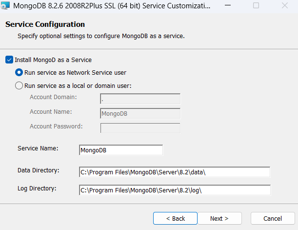
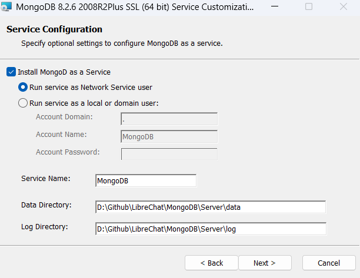
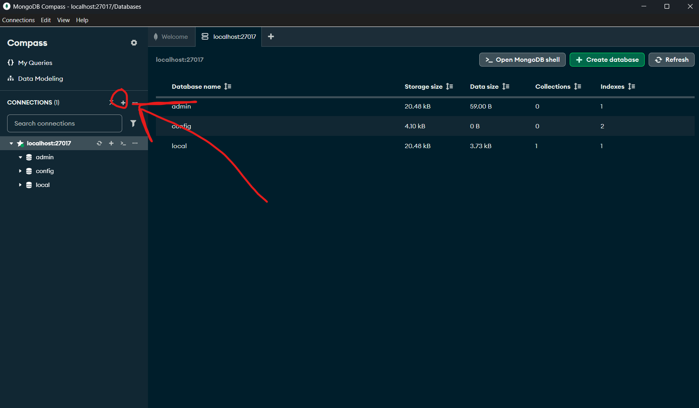
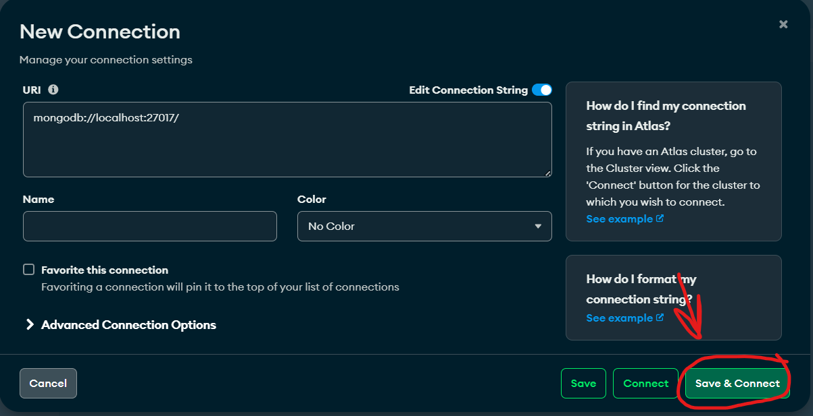
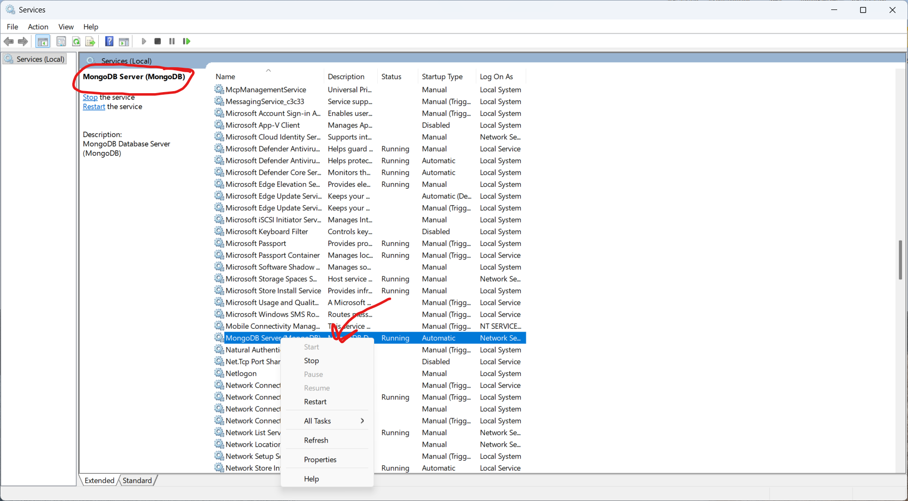

# NPM Installation (Dev)

If you prefer using NPM, or are actively developing it, you'll most likely be building and use it this way.

### Prerequisites

* Node.js v20.19.0+ (or ^22.12.0 or >= 23.0.0): https://nodejs.org/en/download
    - LibreChat uses CommonJS (CJS) and requires these specific Node.js versions for compatibility with openid-client v6

* Git: https://git-scm.com/download/

* MongoDB Community Server
    - [MongoDB Community Server](https://www.mongodb.com/try/download/community)

> Assuming that you already have cloned the repo and made your configurations, you'll move onto the next part.


### Installation of MongoDB

#### 1. Launch the MongoDB file you downloaded
When prompted, you will click Complete Setup Type.


Next, you'll have a window like this:



You may configure what you'd like, but for default you'll only want to change the Data Directory and Log Directory.

Keep the following the same:
```
[x] Install MongoD as a Service
    [x] Run service as Network Service user
```

For my setup, I use this:



I created a folder called `MongoDB` and inside that folder you create `Server\data`, and `Server\log`.

---

#### 2. Adding a connection

Note: This is for the GUI that MongoDB installed, if you aren't using this then you need to use commands to set it up.



Next after clicking the add icon:



Keep everything default and just save and connect.


#### 3. For development

After that, we need to setup our enviorment for development, you will run the commands in the following order:

We need to do a clean install:

```
npm ci
```

Then, to build frontend:
```
npm run frontend
```

Then, when that finishes we need to open two terminals, you will run each line once in each terminal:

Terminal 1:
```
npm run backend:dev
```

Terminal 2:
```
npm run frontend:dev
```

Finally, head to this link:

```
http://localhost:3090
```

### Troubleshooting
If you're having problems with mongoDB, and need to restart it you need to hit `Win + R`and type `services.msc` then do the following:



If it isnt started, make sure to start it, if anything you can restart it entirely.


Now you're able to make live edits and code!

*I will update this later with better explainations n stuff*